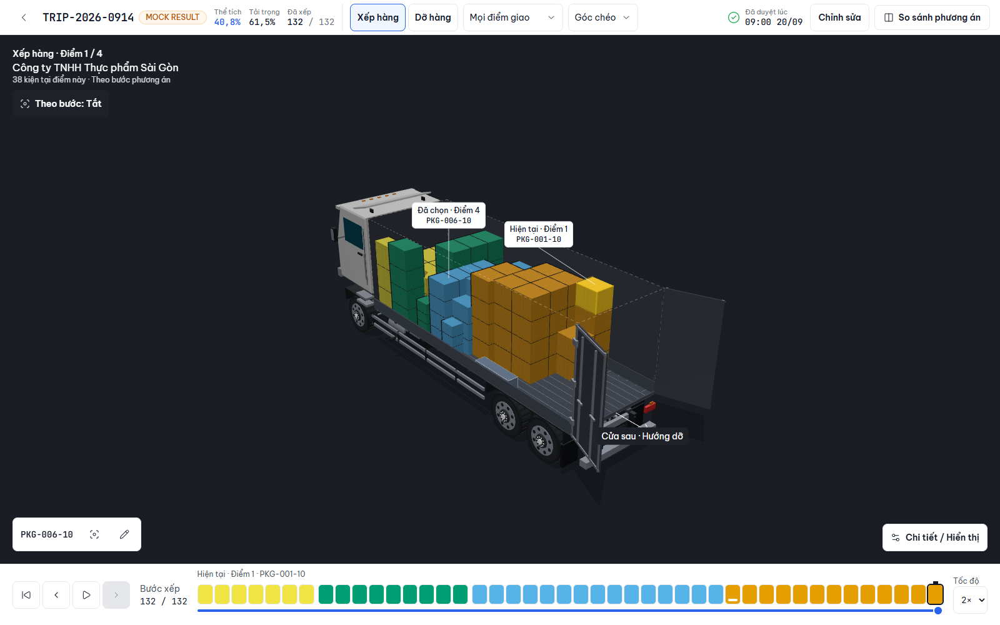

# LoadMaster — Frontend

Hệ thống lập kế hoạch và **tối ưu chất xếp hàng hoá 3D** cho doanh nghiệp vận tải vừa và nhỏ tại Việt Nam.
Một codebase responsive phục vụ 5 vai trò, từ màn điều phối nhiều cột trên desktop tới màn tài xế một tay trên điện thoại.
Giao diện tiếng Việt, chuyển được sang tiếng Anh ngay trong phiên làm việc.



## Làm được gì

| Vai trò | Thiết bị | Luồng chính |
|---|---|---|
| Điều phối | Desktop | Tạo chuyến và kiện hàng, chạy tối ưu, xem phương án 3D, chỉnh tay từng kiện, so sánh phương án và **duyệt** |
| Kho | Máy tính bảng | Mở phương án đã duyệt, xếp từng kiện theo thứ tự, xem vị trí kiện trong thùng bằng 3D |
| Tài xế | Điện thoại | Danh sách kiện theo điểm giao, mô phỏng thứ tự dỡ |
| Quản lý | Desktop | Bảng điều khiển với chỉ số lấy từ dữ liệu trong kho |
| Quản trị | Desktop | Danh sách người dùng |

Phần 3D dựng bằng Three.js: 1.000 kiện vẫn dưới 100 draw call, có chế độ chỉnh tay với kiểm tra ràng buộc
(chồng lấn, quá tải, chịu tải, hướng đặt, khoảng hở cửa) chạy ngay khi thả kiện.

## Chạy thử

Yêu cầu Node ≥ 22 và pnpm (khai trong `package.json`).

```bash
pnpm install --frozen-lockfile
pnpm dev
```

Thêm `?lang=en` vào URL để xem bản tiếng Anh.

## Trạng thái

- **MVP theo Build Spec**, nghiệm thu 16/09/2026 — đối chiếu từng dòng tiêu chí trong [docs/acceptance.md](docs/acceptance.md).
- **Chưa nối backend.** Dữ liệu nằm trong kho in-memory (`src/lib/mock-db`) và mất khi tải lại trang.
  Mọi kết quả tối ưu mang nhãn **MOCK RESULT**.
- Đơn vị toàn hệ thống là cm/kg theo Build Spec; không có chuỗi tiếng Việt cứng ngoài từ điển (có test chặn).

## Kiến trúc

```text
src/domain                 logic thuần theo Spec: hình học cm, 6 hướng đặt, ràng buộc (trả mã lỗi), chỉ số
src/services/optimization  interface OptimizationService; bản mock tất định chạy trong Web Worker
src/lib/mock-db            kho in-memory thay backend: xe, chuyến, kiện, phương án
src/features/<màn>         <màn>-api.ts (nơi duy nhất biết nguồn dữ liệu) → hook TanStack Query → component
src/features/viewer3d      toàn bộ Three.js; một SceneCanvas dùng chung cho Planner, kho và tài xế
```

Nối backend thật: thay thân hàm trong `features/*/*-api.ts` và `createOptimizationService`; hook và component giữ nguyên.

## Kiểm thử

```bash
pnpm lint          # oxlint
pnpm build         # tsc -b + vite build
pnpm test          # Vitest: 520 test unit + DOM
pnpm test:e2e      # Playwright: 55 test trên desktop / tablet / phone
pnpm test:bench    # cổng ngân sách hiệu năng của bộ kiểm ràng buộc
```

CI chạy lint, kiểm kiểu, unit và E2E trên mỗi lần push (`.github/workflows/ci.yml`).

## Tài liệu

| Tài liệu | Nội dung |
|---|---|
| [AGENTS.md](AGENTS.md) | Luật của repo: design token, luật thành phần, quy ước 3D, cách viết test |
| [docs/build-spec.md](docs/build-spec.md) | Đặc tả gốc: mô hình dữ liệu, contract tối ưu, tiêu chí nghiệm thu |
| [docs/prd.md](docs/prd.md) | Quyết định phạm vi |
| [docs/handoff.md](docs/handoff.md) | Bàn giao hiện trạng: route, dữ liệu mẫu, nợ kỹ thuật |
| [docs/acceptance.md](docs/acceptance.md) | Nghiệm thu, đối chiếu từng dòng tiêu chí với test |
| [docs/progress.md](docs/progress.md) | Nhật ký tiến độ theo ngày |
| [docs/screenshots/handoff/](docs/screenshots/handoff/) | Ảnh toàn bộ màn, bản tiếng Việt và tiếng Anh |

Hai trang tài liệu giao diện chạy được trong app: `/kieu-dang` (style sheet) và `/thanh-phan` (bảng thành phần).
