# Ảnh giao diện LoadMaster — 17/09/2026

11 ảnh PNG chụp mới trên Chromium headless + SwiftShader từ Vite local tại baseline `b1fa061`.
Tiếng Việt, deviceScaleFactor = 1; không ép quality tier. Kích thước tablet/phone là viewport giả lập,
không phải ảnh chụp thiết bị thật. Ảnh giữ nguyên giao diện, không chỉnh sửa hình hoặc che lỗi bố cục.
Mỗi màn dùng browser context mới và đăng nhập demo. Các phiên chụp hoàn thành không ghi nhận `pageerror`.

Ảnh là vùng nhìn hiện tại, không phải toàn bộ phần có thể cuộn. Preview 3D xe mặc định tier low nên bề mặt có thể mềm;
ảnh tĩnh không chứng minh FPS, drag hoặc animation. Ảnh partial có toast kết quả thật sau khi mock service chạy.

| # | Màn | Viewport | File |
|---|---|---|---|
| 1 | Dashboard | 1600 × 1000 | [PNG](images/vi-dashboard.png) |
| 2 | Cấu hình xe và vật cản | 1600 × 1000 | [PNG](images/vi-vehicle-detail.png) |
| 3 | Chi tiết chuyến và kiện | 1600 × 1000 | [PNG](images/vi-trip-packages.png) |
| 4 | Thiết lập tối ưu | 1600 × 1000 | [PNG](images/vi-optimization-setup.png) |
| 5 | Planner — bản đã duyệt | 1600 × 1000 | [PNG](images/vi-planner-success.png) |
| 6 | Planner — chỉnh sửa kiện | 1600 × 1000 | [PNG](images/vi-planner-editor.png) |
| 7 | Planner — kết quả một phần | 1600 × 1000 | [PNG](images/vi-planner-partial.png) |
| 8 | Planner — bản lỗi thời | 1600 × 1000 | [PNG](images/vi-planner-stale.png) |
| 9 | Kho — bước xếp đầu tiên | 1024 × 768 | [PNG](images/vi-warehouse-tablet.png) |
| 10 | Tài xế — điểm giao đầu tiên | 390 × 844 | [PNG](images/vi-driver-phone.png) |
| 11 | Tài xế — vị trí hàng 3D | 390 × 844 | [PNG](images/vi-driver-3d-phone.png) |

## 1. Dashboard

Route `/`. Số lấy từ kho seed hiện tại: 4 xe, 132 kiện, 5.844 kg. Handoff gốc ghi 3 xe là thông tin cũ;
ảnh và code hiện tại là nguồn đối chiếu cho lần nghiên cứu này.

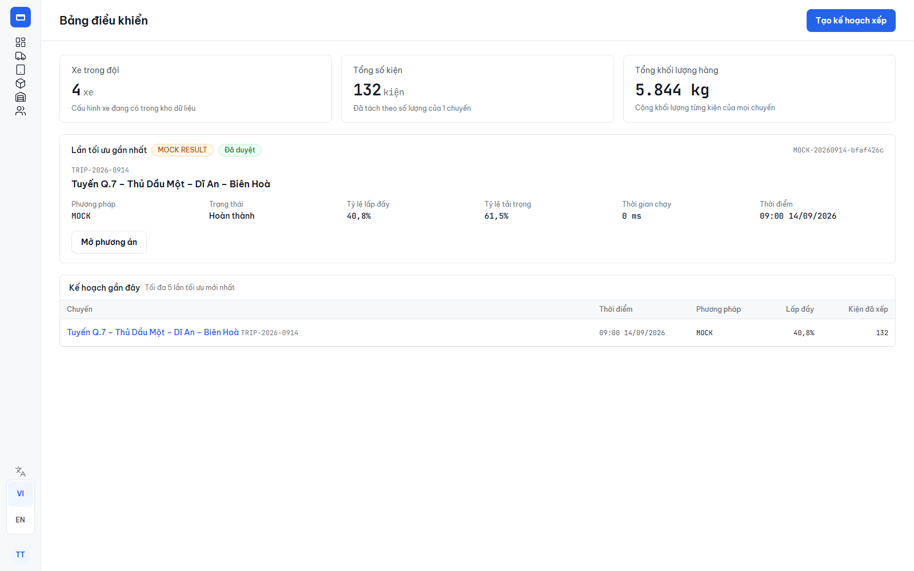

## 2. Cấu hình xe

Route `/doi-xe/VEHICLE-002`. Form cm/kg, cửa, vật cản và preview 3D. Có nội dung bên dưới vùng chụp và bảng cuộn ngang.

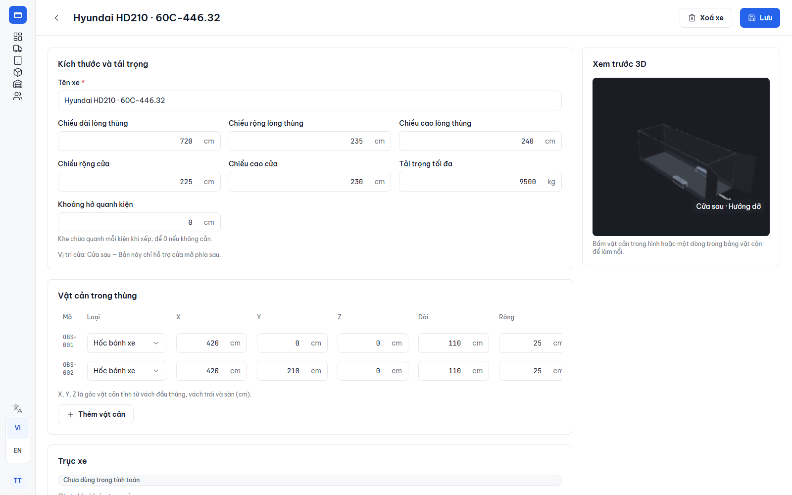

## 3. Chuyến và kiện

Route `/chuyen/TRIP-2026-0914`. 6 dòng kiện mở quantity thành 132 instances, 4 điểm giao.

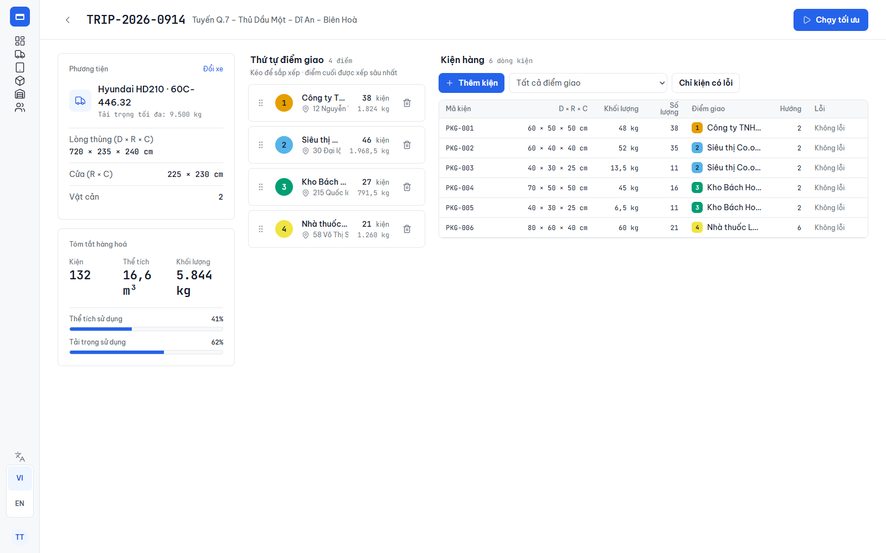

## 4. Thiết lập tối ưu

Route `/chuyen/TRIP-2026-0914/toi-uu`. Trạng thái đầu vào hợp lệ, phương pháp mock.

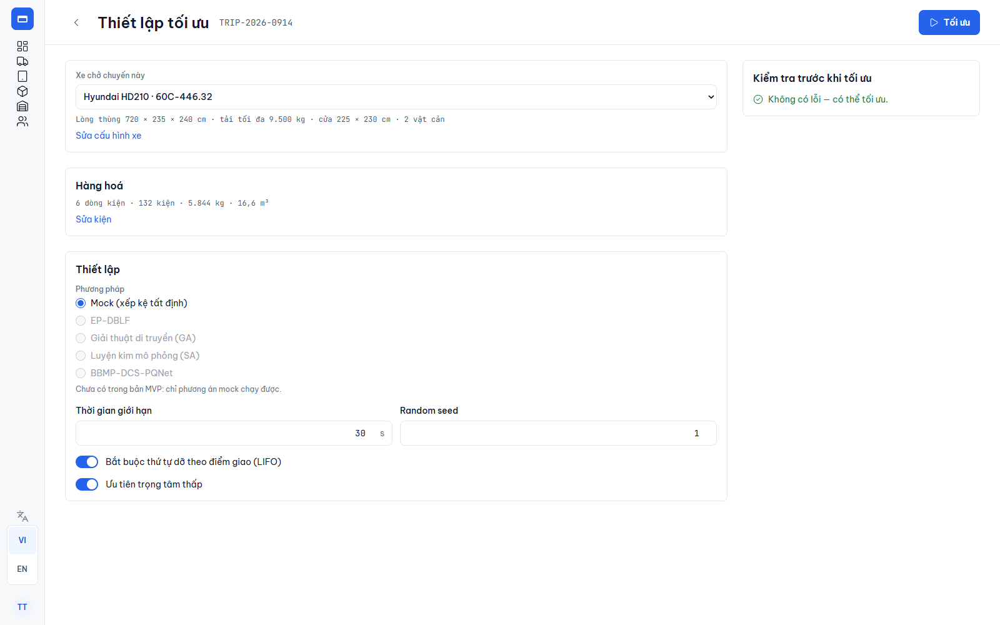

## 5. Planner đã duyệt

Route `/chuyen/TRIP-2026-0914/phuong-an`. Bản seed đã duyệt, 132/132 kiện. Giá trị runtime 0 ms là của seed,
không phải số đo tốc độ optimizer. Xe, cửa, mặt sàn và hàng là scene đang render thật.

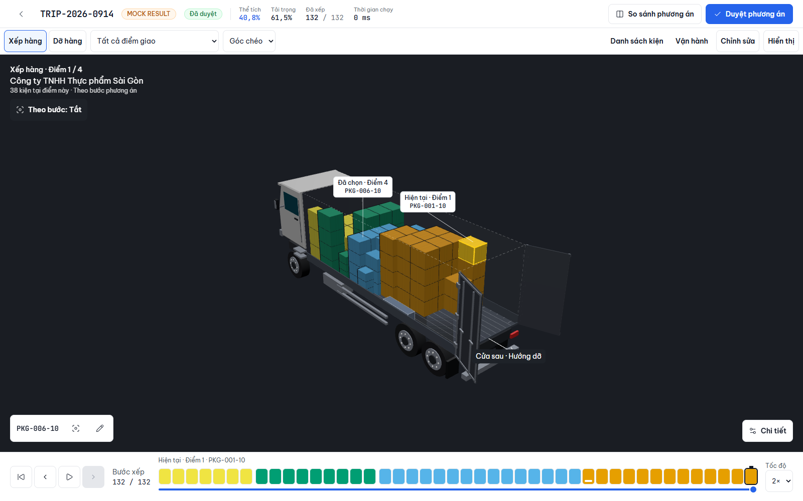

## 6. Editor

Cùng route Planner, bấm Chỉnh sửa và chọn `PKG-006-18`. Chưa di chuyển hoặc lưu draft; ảnh thể hiện các điều khiển
nudge theo cm, sáu hướng đặt, mặt phẳng kéo, snap và pin.

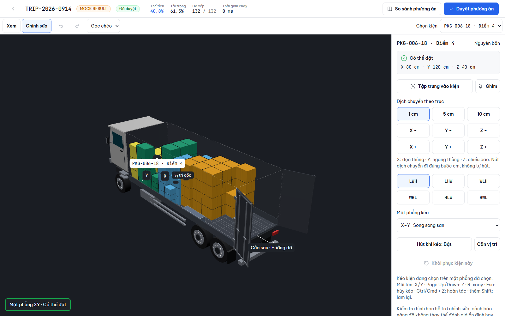

## 7. Kết quả một phần

Trong một phiên mock tách biệt, thêm dòng `PKG-950`, quantity 60, không bắt buộc; sau đó chạy mock optimization bằng UI.
Kết quả thực tế của phiên: 162/192 kiện, 30 chưa xếp. Thay đổi chỉ ở bộ nhớ phiên chụp, không sửa seed/source.

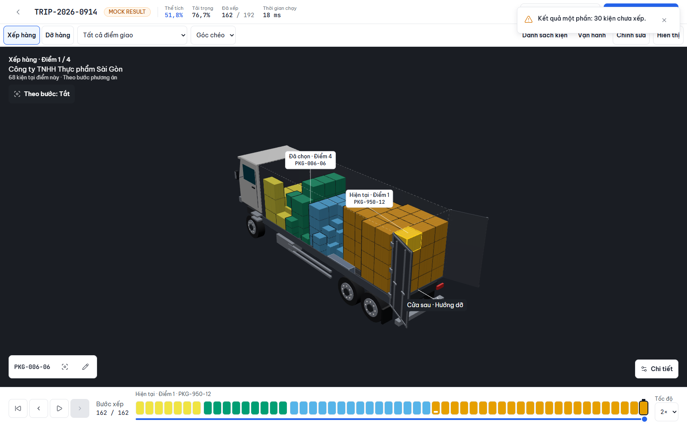

## 8. Phương án lỗi thời

Trong phiên tách biệt, tăng khối lượng kiện đầu tiên 1 kg sau kết quả seed, rồi mở Planner bằng điều hướng nội bộ.
Banner lỗi thời và lý do chưa duyệt được xuất hiện; không sửa seed/source.

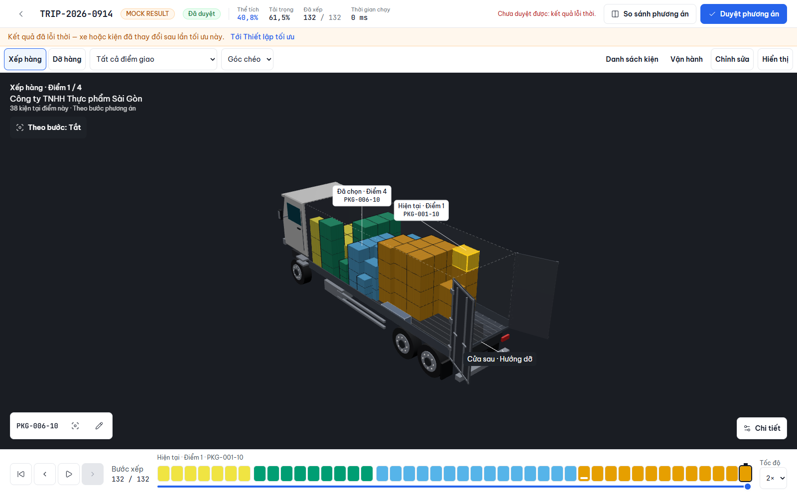

## 9. Kho tablet

Route `/kho`, bước 1/132, đọc revision đã duyệt theo loadingOrder.

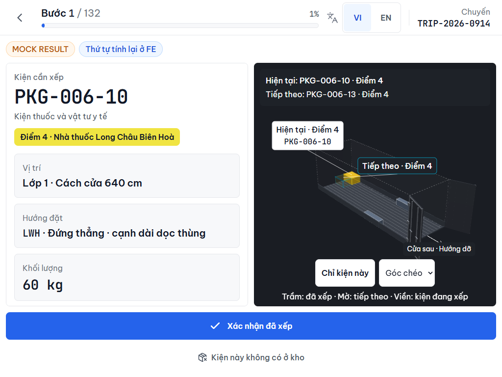

## 10. Tài xế phone

Route `/tai-xe/diem-giao`, điểm 1/4, danh sách theo unloadingOrder, chưa đánh dấu kiện đã dỡ.

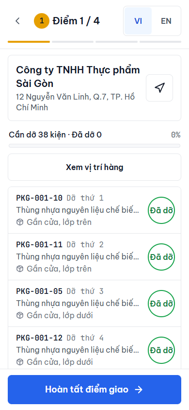

## 11. Tài xế 3D

Từ màn tài xế, bấm Xem vị trí hàng; camera cửa sau và điều khiển mô phỏng dỡ. Không đánh dấu giao hàng qua mô phỏng.

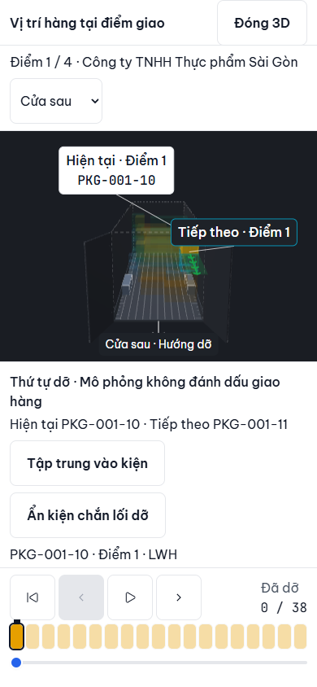

## Chụp lại

Từ gốc repo, có dev server ở 5175 và Chromium của Playwright:

```powershell
node docs/research-handoff-2026-09-17/capture.mjs
node docs/research-handoff-2026-09-17/capture-extra.mjs
```

Script đầu dựa trên `tests/handoff-screenshots.mjs` có sẵn, giới hạn tiếng Việt và đổi thư mục output.
Script thứ hai chụp editor và modal 3D tài xế. Có thể đặt `VIEWER_TEST_URL` để đổi origin.
