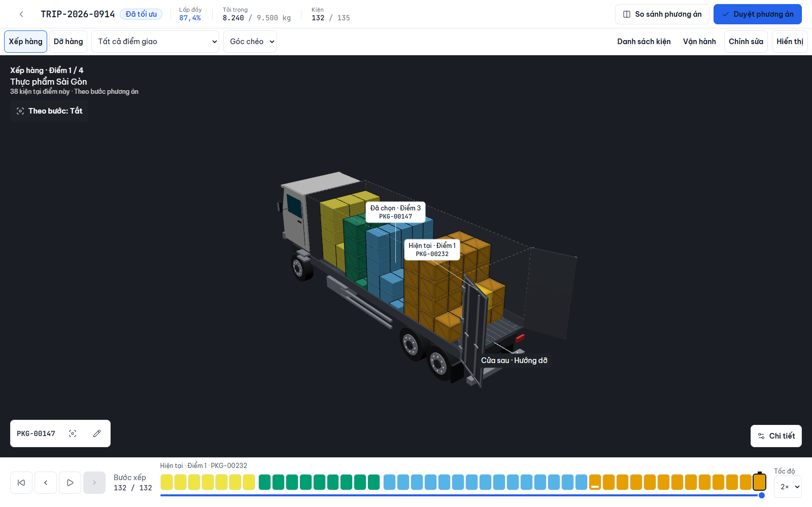

# LoadMaster Frontend — Bàn giao hiện trạng

Ngày cập nhật: 14/09/2026. Repo: `E:\SEP490\LoadMaster`. Branch: `main`; HEAD tại lúc bàn giao: `6d5fe1e` (`mini update`).

Tài liệu tổng hợp code hiện tại, quá trình nâng cấp trong chuỗi Prompt 1–4 và đợt UX/3D tiếp theo. Các màn ngoài 3D được mô tả là nền frontend đang có, không quy toàn bộ lịch sử khởi tạo repo cho đợt nâng cấp này. Khi nội dung báo cáo giai đoạn cũ khác hiện trạng, ưu tiên code hiện tại và [AGENTS.md](AGENTS.md).

## 1. Kết luận bàn giao

- Frontend tiếng Việt có các màn điều phối, kho, tài xế, quản lý, đội xe, người dùng và tài liệu design system.
- Đã phát triển viewer thành 3D Operations Engine dùng chung cho Planner, Warehouse và Driver; Planner có manual editor và mô phỏng xếp/dỡ.
- Đã bổ sung foundation cho 1.000 placements, draft bất biến, instancing, quality adaptation và render-on-demand; không thay Three/R3F/Drei hoặc thêm physics engine.
- Đợt UX mới ưu tiên vùng scene, inspector mở theo nhu cầu, timeline dễ đọc và phản hồi trực quan tại kiện.
- **Chưa nối backend.** Đăng nhập là mock; `RequireAuth` chỉ kiểm tra đã đăng nhập, chưa có phân quyền theo vai trò. Dữ liệu/form/mô phỏng hiện tại không đồng nghĩa với persistence hoặc nghiệp vụ production đã hoàn tất.
- **Working tree đang có thay đổi chưa commit**, gồm nâng cấp scene-first, tests, AGENTS và tài liệu/ảnh/JSON. Phải giữ cả các file untracked khi chuyển máy hoặc bàn giao; không reset/clean dựa vào HEAD.

## 2. Preview và cách chạy

Dev server đã trả HTTP 200 tại `http://127.0.0.1:5175` khi lập bàn giao. Đây là server phiên làm việc, cần khởi động lại nếu đã tắt máy/process.

```powershell
# Node >=22, pnpm >=11; packageManager khai báo pnpm 11.2.2
pnpm install --frozen-lockfile
pnpm dev --host 127.0.0.1 --port 5175
```

Tài khoản **demo**: `dieuphoi@loadmaster.vn` / `loadmaster` (khai báo công khai trong `features/auth/auth.mock.ts`). Phiên tạm dùng sessionStorage.

| Preview | Đường dẫn |
|---|---|
| Planner sản phẩm | `/chuyen/TRIP-2026-0914/phuong-an` |
| Planner benchmark | `/chuyen/TRIP-2026-0914/phuong-an?debug&packages=1000&quality=balanced` |
| Kho | `/kho` |
| Tài xế | `/tai-xe/diem-giao`, sau đó bấm “Xem vị trí hàng” |
| Tài liệu UI | `/kieu-dang`, `/thanh-phan` |

Benchmark nhận 132/300/500/1000; quality nhận high/balanced/low. Thiếu `debug` thì không kích hoạt fixture benchmark. `?debug` đơn lẻ vẫn dùng mock nghiệp vụ 132 kiện; `?debug&packages=132` dùng fixture riêng.



[Ảnh editor 1.000 kiện](docs/screenshots/scene-first/07-edit-valid-snap.png) · [Overlap](docs/screenshots/scene-first/08-edit-overlap.png) · [Driver phone](docs/screenshots/scene-first/10-driver-phone.png). Bộ 12 ảnh và mô tả từng cảnh nằm trong [báo cáo scene-first](docs/viewer-scene-first-report.md).

## 3. Bản đồ frontend hiện có

Router chính: [src/app/App.tsx](src/app/App.tsx). Các màn nghiệp vụ lazy-load; viewer/kho/tài xế là màn toàn màn hình, không dùng nav rail. Trang lỗi là fallback riêng.

| Nhóm | Route | Hiện trạng / điểm vào code |
|---|---|---|
| Đăng nhập | `/dang-nhap` | `features/auth`: mock login/logout, AuthProvider, RequireAuth; chưa RBAC |
| Dashboard | `/` | `features/manager/DashboardPage.tsx`; dữ liệu mẫu, bộ lọc/xuất báo cáo còn thông báo chờ |
| Chuyến hàng | `/chuyen`, `/chuyen/moi`, `/chuyen/:tripId`, `/chuyen/:tripId/sua` | `features/trips`; danh sách, form, chi tiết; danh sách đi qua `trips-api` + `useTripsQuery`, API đang trả mock |
| So sánh phương án | `/chuyen/:tripId/so-sanh` | `PlanComparisonPage`; ảnh tĩnh SVG, dữ liệu mẫu |
| Tối ưu | Từ workflow chuyến hàng | `features/optimization`; progress/job mô phỏng, chưa chạy optimizer thật |
| Planner 3D | `/chuyen/:tripId/phuong-an` | `features/viewer3d/ViewerPage.tsx`; inspect/edit/operations |
| Kho | `/kho` | `features/warehouse/LoadingStepPage.tsx`; hướng dẫn từng bước và PositionViewer |
| Tài xế | `/tai-xe/diem-giao`, `/tai-xe/:tab` | `features/driver/DriverStopPage.tsx`; danh sách nghiệp vụ và 3D lazy; `/tai-xe` redirect |
| Đội xe | `/doi-xe` | `features/fleet/FleetPage.tsx`; state local từ mock, chưa persistence |
| Người dùng | `/nguoi-dung` | `features/admin/UsersPage.tsx`; state local từ mock, chưa persistence |
| Design system | `/kieu-dang`, `/thanh-phan` | `app/design-system`; token/component thật để tham chiếu |

Stack hiện tại: React 19, Vite 8, TypeScript 6, Tailwind v4, Radix trực tiếp, TanStack Query/Table v9, RHF + Zod, React Router v7, Recharts, dnd-kit, Lucide, Sonner, Motion. 3D dùng Three, R3F, Drei, camera-controls và react-spring/three. Phiên bản cụ thể theo `package.json` và lockfile; không tự nâng major.

`src/index.css` là nguồn token; `components/ui` chứa primitives; `lib/format.ts` định dạng Việt Nam; `lib/pending-feature.ts` thông báo thao tác chưa nối. Không coi nút thông báo pending là đã gửi dữ liệu thành công.

## 4. Quá trình đã thực hiện

### Giai đoạn 1 — Foundation / Prompt 1

Giữ Canvas, CameraControls/presets, instancing, picking instanceId, màu, slice, playback, selected label, orientation, pin, axle panel và viewer kho. Thay các Map override rời bằng ViewerDraft theo ID, thêm adapter và effective scene.

- Giải đúng contract orientation: kích thước domain đã xoay → canonical dimensions → hướng đích; kiểm tra cả nguồn 1/2 và đủ chín cặp nguồn/đích.
- Tách đường cập nhật màu/ma trận; chỉ upload slot thay đổi. Bounds phục vụ raycast dựng khi geometry thay đổi, không computeBoundingSphere mỗi animation frame.
- Có fixture deterministic riêng 132/300/500/1000, không overlap/vượt thùng và không thay mock nghiệp vụ.
- Thêm high/balanced/low, demand rendering và debug metrics; scene nghỉ ngừng render.

Chi tiết và phép đo lịch sử: [viewer-foundation-report.md](docs/viewer-foundation-report.md). Các đoạn “chưa làm Prompt 2–4” trong báo cáo này chỉ nói về thời điểm giai đoạn 1.

### Giai đoạn 2 — Manual editor / Prompt 2

- Xem/Chỉnh sửa tách rõ. Chỉ kiện được chọn có một proxy; cargo khác vẫn là instances.
- Drag theo mặt phẳng X–Y/X–Z/Y–Z, pointer capture; camera và raycast cargo tạm dừng trong gesture rồi được phục hồi khi thả/hủy/blur/unmount.
- Nudge 10/50/100 mm, keyboard/touch, rotate 0/1/2, snap floor/walls/grid/cargo faces; một gesture tạo một command.
- Chặn commit khi overlap/out-of-bounds hoặc geometry sai. Support yếu, dễ vỡ và chỉnh thủ công là advisory; coverage dùng union diện tích tiếp xúc.
- Undo/redo theo patch, tối đa 200 commands; pin khóa move/rotate; reset riêng và reset toàn bộ có kiểm tra/xác nhận phù hợp.

Chi tiết: [viewer-editor-report.md](docs/viewer-editor-report.md). Draft/history chưa lưu qua phiên và không tạo Placement từ UnplacedPackage.

### Giai đoạn 3 — Operations / Prompt 3

- Loading lấy `placement.step`; unloading dùng thứ tự **gợi ý**: stop tăng, cao trước, gần cửa trước.
- Thêm focus stop, current/next/future/removed, rear-door context, phân bố stop từ geometry thật và blocker advisory theo hành lang +X.
- Tách stop-order consistency khỏi unload accessibility; sửa wording approval để không khẳng định LIFO đã được chứng minh.
- Thêm tâm khối lượng hàng từ center × weight; axle UI hiển thị số load/capacity của phương án nguồn.
- Playback dỡ dùng một proxy; reduced motion không dịch chuyển lớn.

### Giai đoạn 4 — Shared engine / Prompt 4

- Planner, PositionViewer và DriverCargoViewer dùng chung SceneCanvas; UI/workflow ở wrapper riêng.
- Kho có current/next, isolate, viền giúp tìm kiện sâu và hướng dẫn placement; không có editor.
- Driver chỉ tải Three khi mở “Xem vị trí hàng”, có rear-door/focus/blocker/unload preview; mô phỏng không đánh dấu đã giao.
- Runtime quality có hysteresis/cooldown, bỏ qua idle; phone/tablet có panel dưới/drawer và touch alternatives.
- Xe có cabin, kính/gương, grille/đèn, bậc lên xuống, bánh/mâm, khung/gầm và hardware cửa. Geometry phụ gộp theo vật liệu, bánh dùng instancing; đây là mô hình minh họa xe.

Chi tiết giai đoạn 3–4: [viewer-operations-report.md](docs/viewer-operations-report.md).

### Giai đoạn 5 — Scene-first UX và visual mới nhất

- Bỏ hai panel thường trực; dành diện tích cho scene, mở inspector theo nhu cầu. “Duyệt phương án” giữ vai trò primary duy nhất.
- Timeline đổi sang ô đều nhau, khoảng cách/marker rõ; 8–64 bins theo chiều rộng, slider giữ toàn bộ bước.
- Bản đồ stop mặc định tắt, nằm trong mép sàn; đã sửa dải màu ngoài xe và thêm regression bounds.
- Hover/selected/current/next có phản hồi ngắn, nhãn bounded và leader đúng vật thể; double-click focus giữ hướng, Esc/“Xem toàn xe” phục hồi camera. Theo bước tạm dừng khi người dùng tự xoay.
- Editor thêm mặt phẳng, đường đo, mặt snap, vùng overlap, vị trí gốc và HUD trạng thái. Preview ghi Three/DOM imperative; không rerender cả scene mỗi pointer frame.
- Dỡ gặp blocker thì giữ target và tạm dừng. Click blocker chỉ inspect/focus, có quay lại target; người dùng có thể chủ động bỏ qua bước mô phỏng, khi bị cản chỉ fade tại chỗ.
- CoM có marker nhìn được khi bị hàng che, projection và lệch tâm ngang. Atlas chung phân biệt carton/pallet/crate bằng thuộc tính instance.
- Đã sửa nhãn chồng/tràn phone, nút trắng trên trắng, status đè đường đo; focus stop đưa current về kiện đầu tiên của stop đó.

Chi tiết và ảnh: [viewer-scene-first-report.md](docs/viewer-scene-first-report.md).

## 5. Kiến trúc và điểm vào cần giữ

```text
Immutable LoadPlan
  → adaptLoadPlan → ViewerSceneModel
                     + ViewerDraft theo placementId (Planner)
                     → Effective placements + SceneSemantics
                     → SceneCanvas
                        ├─ Planner: ViewerPage / LoadPlanViewer
                        ├─ Warehouse: PositionViewer
                        └─ Driver: DriverCargoViewer
```

| Trách nhiệm | File / thư mục trong `src/features/viewer3d` |
|---|---|
| Adapter/canonical dimensions | `viewer-scene-model.ts` |
| Draft và state viewer | `viewer-draft.ts`, `useLoadPlanViewer.ts` |
| Core render, ID mapping/buffers | `scene/SceneCanvas.tsx`, `CargoInstances.tsx`, `instance-layout.ts`, `useCargoMatrices.ts`, `useCargoColors.ts`, `cargo-buffers.ts` |
| Camera và cues | `scene/CameraRig.tsx`, `CargoFeedback.tsx`, `SceneCallout.tsx`, `SelectionLabel.tsx` |
| Editor geometry/history | `editor/geometry.ts`, `snapping.ts`, `draft-history.ts`, `useManualEditor.ts`, `EditorProxy.tsx` |
| Editor visual/preview | `editor/spatial-feedback.ts`, `EditorSpatialFeedback.tsx`, `EditorGestureHud.tsx`, `preview-store.ts` |
| Operations | `operations/operations-model.ts`, `scene-semantics.ts`, `useOperations.ts`, `useUnloadPlayback.ts`, `UnloadMotion.tsx`, `ExtractionCorridor.tsx` |
| Workspace/HUD | `ViewerPage.tsx`, `panels/WorkspaceToolbar.tsx`, `SceneInspector.tsx`, `operations/SceneHud.tsx`, `Timeline.tsx` |
| Quality/benchmark | `usePerformanceFlags.ts`, `quality-policy.ts`, `DebugOverlay.tsx`, `scene/PerfProbe.tsx`, `benchmark.mock.ts` |

Domain chung: `src/types/load-plan.ts`; mock nghiệp vụ chung: `src/lib/load-plan.mock.ts`. Vị trí nghiệp vụ/draft dùng mm: X dọc thùng tới cửa sau, Y ngang, Z cao; Three đổi thành X dọc, Y cao, Z ngang qua `scene/units.ts`.

Invariants: không mutate `plan.placements`; không lấy index danh sách UI làm ID; cargo tối đa ba InstancedMesh; một editor proxy và một unload proxy; feedback phụ có capacity cố định. Bounds raycast vẫn cần dù `frustumCulled=false`. Mọi thay đổi imperative cần invalidate. Overlay thường đặt ngoài Canvas với pointer-events phù hợp; Html chỉ dùng khi neo vật thể.

## 6. Bằng chứng kiểm tra và performance

Kết quả gần nhất của đợt code trước bàn giao: **37 tests TypeScript pass**, 7 suite browser pass, `pnpm lint` và `pnpm build` pass. Lần bàn giao này chỉ kiểm tra hiện trạng và viết tài liệu, không chạy lại toàn bộ suite hoặc sửa ứng dụng.

Browser suites: `viewer-ui`, `viewer-editor-ui`, `viewer-operations-ui`, `viewer-visuals`, `viewer-demand-quality`, `viewer-scene-first-ui` nay là `e2e/*.spec.ts` chạy bằng `@playwright/test` (LM-005); `viewer-benchmark` vẫn là script chạy tay trong `tests/`. Kiểm tra bao gồm picking 1.000 kiện, editor/history, camera/capture, slice/màu, xếp/dỡ, kho/driver lazy, reduced motion, quality và idle. Bằng chứng này chủ yếu bao phủ viewer và tích hợp kho/tài xế, không phải chứng nhận QA toàn bộ FE.

Benchmark cuối: Chromium headless 149 + SwiftShader, viewport 1600×1000, DPR thiết bị 1; **không phải thiết bị vật lý**.

| Kiện | Tier / DPR render | Draw calls | Tam giác | FPS quan sát khi kéo |
|---:|---|---:|---:|---:|
| 132 | low / 0,5 | 16 | 3.428 | 60 |
| 300 | low / 0,5 | 16 | 7.460 | 60 |
| 500 | low / 0,5 | 16 | 12.260 | 60 |
| 1.000 | low / 0,5 | 16 | 24.260 | 22 |
| 1.000 | balanced / 1 | 25 | 41.444 | 14 |
| 1.000 | high / 1 | 33 | 58.378 | 9 |

Draw calls mặc định trước/sau đợt scene-first giữ 16/25/33 theo tier. Canvas mới rộng hơn nên pixel workload khác. Lượt operations riêng ghi 37 FPS ở low/1.000, cho thấy biến động phần mềm; chưa thể xác nhận target desktop 60/tablet 45–60/phone khoảng 30 FPS. Demand đã ghi nhận 0 frame thừa khi nghỉ.

Raw data: [benchmark cuối](docs/benchmarks/viewer-scene-first-2026-09-14.json), [operations regression](docs/benchmarks/viewer-scene-first-operations-2026-09-14.json), [visual QA](docs/benchmarks/viewer-scene-first-visual-qa-2026-09-14.json). Build còn warning chunk >500 kB; SceneCanvas khoảng 668 kB minified / 184 kB gzip và vẫn lazy-load.

```powershell
pnpm lint
pnpm build
pnpm test            # Vitest: project unit (tests/**/*.test.ts, src/**/*.test.ts) + dom (src/**/*.dom.test.tsx); từ 14/09/2026 thay cho node --test
pnpm test:e2e        # Playwright (LM-005): tự bật Vite ở 127.0.0.1:5175 (dùng lại server đang chạy nếu không phải CI); project desktop/tablet/phone
pnpm test:e2e:ui     # chế độ UI của Playwright
# Máy mới: pnpm exec playwright install chromium (Chromium 149, revision 1228)
# Benchmark FPS chạy tay, không nằm trong test:e2e hay CI; cần dev server chạy riêng:
pnpm dev --host 127.0.0.1 --port 5175 --strictPort
node tests/viewer-benchmark.mjs          # thêm --low-only để chỉ đo tier low; VIEWER_TEST_URL nếu server ở địa chỉ khác
```

Chạy benchmark tách khỏi build hoặc browser suite khác để giảm nhiễu CPU/GPU. Ảnh, số đo và báo cáo E2E nằm trong `test-results/` và `playwright-report/`; output benchmark tạm trong `node_modules/.tmp/viewer-final`; bằng chứng cần giữ đã copy vào `docs`.

## 7. Source / Derived / Advisory / Chưa có backend

| Loại | Nội dung |
|---|---|
| Source | ID, position, dimensions đã orientation, weight, step, stop, packaging, fragile/pinned, kích thước thùng, load/capacity trục từ LoadPlan |
| Derived | Effective placements, trạng thái xếp/dỡ, CoM hàng, phân bố thể tích stop, khoảng cách, bins, tỷ lệ tải từ số nguồn |
| Advisory | Suggested unload order, blocker hành lang thẳng, weak support, fragile contact, manual-change warning |
| Backend cần bổ sung | Revision/version snapshot; lưu/duyệt draft và concurrency; authoritative unload sequence; axle positions, wheelbase, tare weight/CoM, vehicle configuration, kingpin nếu semi-trailer; dữ liệu clearance/thao tác nếu cần xác nhận khả năng dỡ |

Stop-order consistency chỉ xác nhận trình tự stop của loading steps. CoM không phải trọng tâm toàn xe. Axle load chưa tính lại sau edit/dỡ. Support coverage không phải stability solver; fixture có khe hở có thể bị advisory ngay khi chưa chỉnh.

## 8. Giới hạn và ưu tiên tiếp theo

1. **Bàn giao source:** xem `git diff` và file untracked; lưu/commit trọn bộ công việc hiện tại theo quy trình của nhóm. Chưa có commit mới được tạo trong lần bàn giao này.
2. **QA thiết bị thật:** PC/tablet/phone, GPU thật, orbit/pinch/drag, nhiệt/pin, ánh sáng kho/ngoài trời, màn nhỏ và các tổ hợp lớp phân tích. Tiếp tục đo trước khi thêm hiệu ứng.
3. **Backend/auth:** thống nhất contract, RBAC phía server, session thật và quyền duyệt/chỉnh sửa; thay mock ở lớp `*-api` + Query. Fleet/users cần bỏ persistence giả bằng state local khi nối thật.
4. **Draft lifecycle:** revision, lưu/khôi phục, reset khi snapshot đổi, conflict handling; hiện draft không chia sẻ Planner → Kho → Driver và mất khi rời phiên/trang.
5. **Nghiệp vụ còn chờ:** thao tác duyệt/gửi, báo cáo/export, tối ưu thật và các nút pending cần contract rõ; chưa chứng nhận đầy đủ các luồng ngoài 3D.
6. **Performance:** overdraw/transparency/shadows, vertex cost vẫn tăng theo N; hidden instances scale zero vẫn có slot GPU. Approval heuristic O(N²) chỉ tính khi mở dialog. Không thêm spatial hash/BVH khi chưa đo ra nhu cầu.

Deferred có chủ ý: physics/optimizer, người/xe nâng, swept collision đường drag, tái giải stability toàn stack, arbitrary quaternion rotation, tạo Placement từ UnplacedPackage, API/WebSocket/offline/WebGPU. Pallet/crate hiện là biểu diễn bề mặt trên bounding envelope, không dựng cấu trúc từng thanh.

## 9. Cách tiếp tục mà không lãng phí context

Đọc AGENTS và handoff này trước; dùng code/diff hiện tại làm nguồn chuẩn. Chỉ mở module liên quan; các báo cáo giai đoạn là bằng chứng lịch sử, không phải danh sách thiếu hiện tại. Giữ instancing/demand/shared core/immutable draft; không rewrite viewer, không major upgrade, không tự nối backend khi task chỉ UI. Chạy kiểm tra phù hợp thay đổi và full lint/build lúc chốt; không lặp benchmark chỉ để có con số đẹp hơn.
